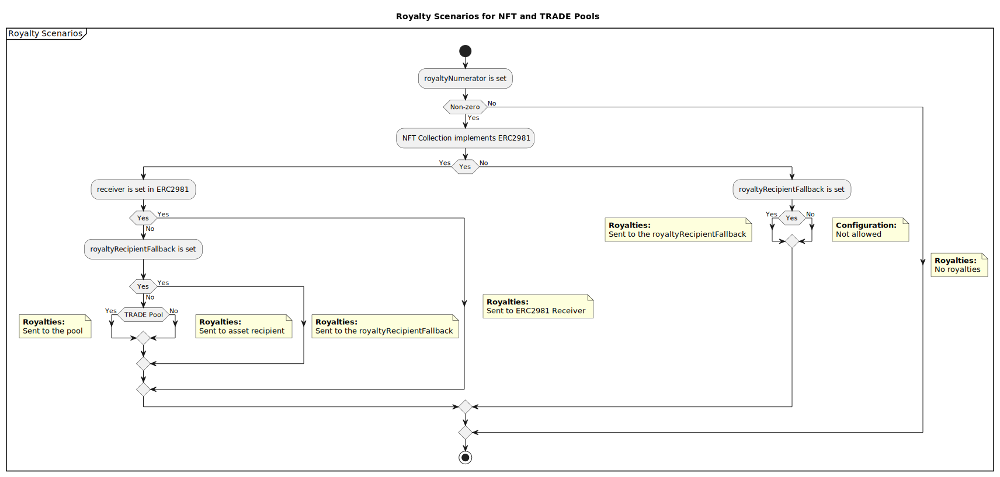

# Collection.xyz Protocol Overview

Collection.xyz is a decentralized, NFT-based automated market maker (AMM) and decentralized exchange (DEX) platform designed for the unique needs of NFT trading. The platform allows users to create customizable liquidity pools for specific token IDs within a collection, making it easy for traders to discover and access liquidity for particular NFT traits.

### Features
1. **Customizable Liquidity Pools**: Users can create trade pools that accept NFTs with specific traits within a collection, allowing for precise control over the types of NFTs traded in each pool.
2. **Tokenized Pool Representations**: Liquidity pool positions are represented as liquidity provider (LP) ownership tokens, enabling seamless integration with other protocols and use cases.
3. **Incentivized Liquidity Provision**: Users can incentivize liquidity providers with ERC-20 or ERC-721 tokens and set the desired criteria for these incentives, encouraging participation in the platform.
4. **Flexible Fee Structures**: Collection.xyz charges 0% protocol fees, with pool creators determining pool fees and royalty percentages. The platform encourages royalties to be honored by pool creators and can incentivize liquidity providers to honor them.
5. **User-Controlled Curves**: Users have full control over bonding curves, pricing functions, and fee structures for their pools, allowing for customized liquidity pool parameters.
6. **Community-Driven Curation**: The hotlist feature fosters community-driven curation and more efficient liquidity provision by allowing users to vote on and promote their favorite pools.

--- 

# Deployment

1. Clone `.env.example` to `.env`, replace the values.

```bash
cp .env.example .env
```

2. Compile contracts

```bash
yarn compile
```

3. Run the deploy script

```bash
# Goerli deployment
yarn deploy --network goerli

# Mainnet deployment
yarn deploy --network mainnet
```

4. Verification Script

Etherscan verification might fail for various reasons. Run `yarn verify --network <network>` in the root directory.

--- 

# Technical Architecture


___

# Process Diagrams and Entry points

1. **Create Pool**<br>
   

2. **Swapping and Trading: User Buying NFT**<br>
   

3. **Swapping and Trading: User Selling NFT**<br>
   

4. **Bonding Curves and Pricing (Example)**<br>
   

# Overview of the Fee Structure in Collection.xyz

There are three parties that can receive fees when a trade is made:

1. The pool creator (User-defined fee)
2. The protocol itself (Collection.xyz) - Flat fee or Carry fee
3. The NFT collection that implements royalties through ERC2981 (Royalty)
Collection.xyz prefers carry fees over flat fees for true two-sided AMM activity (TRADE pools) since DeFi protocols now have zero or near-zero fees and are run as public goods. Flat protocol fees are considered poor design for two-sided AMM activity. In this model, the protocol's take is proportional to the actual fees the user charges, making it a more transparent carry model. Collection.xyz will start with 0% protocol fees, but ultimately aims to make money when the user makes money.

However, flat fees are maintained for NFT/TOKEN pools, as they have one-time liquidity. Since the pool is not a going concern once the trades are fulfilled, it is conceptually cleaner to have flat fees for these sorts of pools.

**Royalty Scenarios**<br>


# FAQ
1. **How do I retrieve bid and ask prices?** Bid/ask prices can be retrieved using getSellNFTQuote and getBuyNFTQuote functions.
2. **What's the difference between TOKEN, NFT, and TRADE pools?** TOKEN/NFT pools are one-sided pools representing limit orders, while TRADE pools are potentially two-sided pools providing liquidity at both bid and ask points.

By streamlining the process of trading NFTs, Collection.xyz aims to provide a combinatorially comprehensive and user-friendly platform for all NFT enthusiasts.